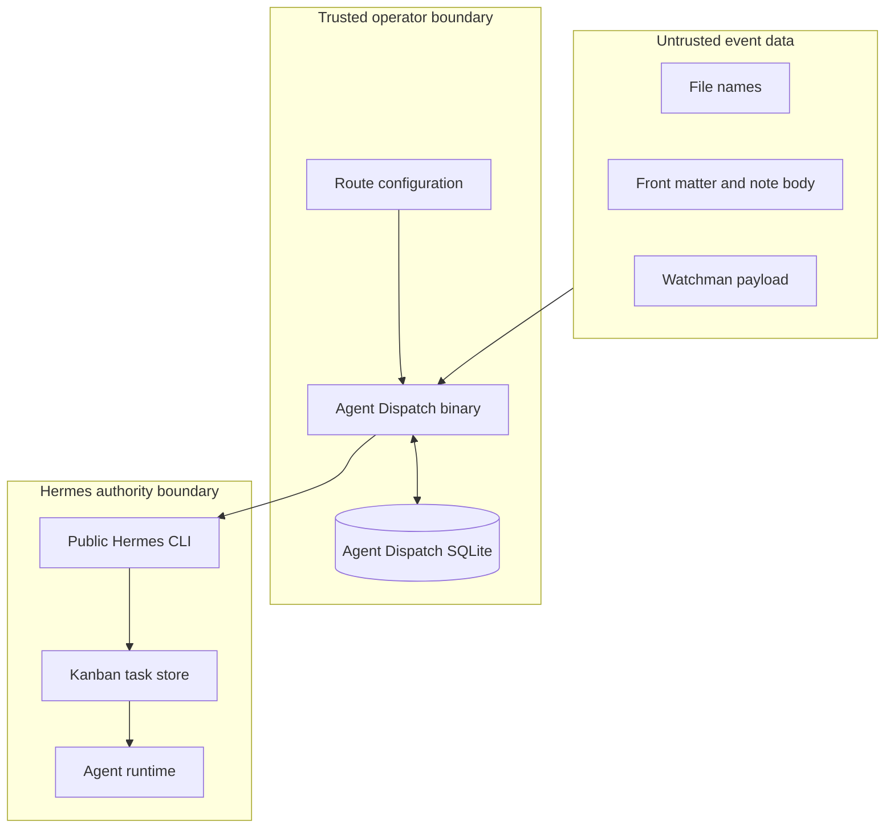
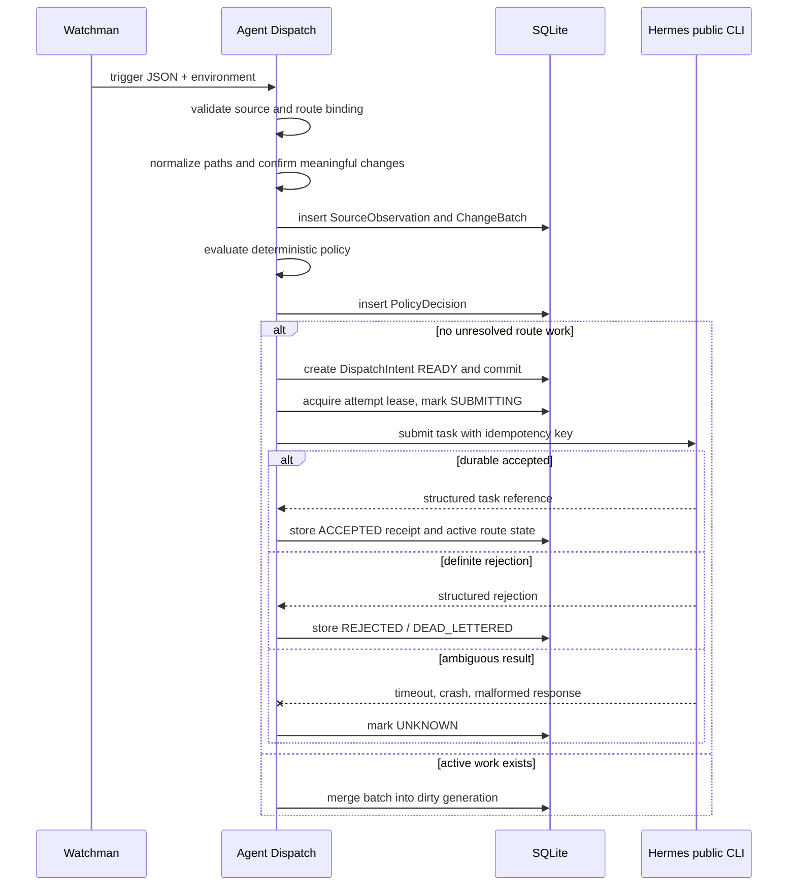

# Architecture Overview

## 1. Architectural Style

Agent Dispatch uses a **hexagonal architecture** with deterministic domain services at the center and source, storage, filesystem, clock, and Hermes integrations at the edges.

The v0.1 process is a short-lived CLI. Watchman owns long-lived filesystem observation. SQLite supplies durable coordination across independent CLI invocations. Hermes owns long-lived agent execution.

```mermaid
flowchart LR
    O[Operator-owned YAML] --> C[Config and Route Registry]
    W[Watchman daemon] -->|stdin JSON + env (source metadata, verify)| CLI[agent-dispatch CLI process]
    CLI --> I[Watchman Ingress Port]
    I --> N[Normalize and Validate]
    N --> P[Deterministic Policy Planner]
    P --> D[Durable Dispatch Service]
    D <--> DB[(SQLite local state)]
    D --> H[Hermes Kanban Adapter]
    H -->|public CLI only| HK[Hermes Kanban]
    HK --> HR[Hermes Runtime]
    HR --> S[LLM Wiki Skill]
    HR -. optional receipt .-> R[agent-dispatch work CLI]
    R --> DB
    CLI --> A[JSON / human audit output]
```

## 2. System Boundary



Trust is not inherited transitively. A valid Watchman invocation proves the configured source process invoked Agent Dispatch; it does not make a file name or note body a trusted instruction. A valid Hermes task receipt proves a target claim was received; it does not automatically prove the reported changed paths are correct.

## 3. Runtime Topology

### v0.1 production topology

```text
one local machine
  Watchman daemon
  Obsidian vault
  zero or more short-lived Agent Dispatch CLI processes
  one local Agent Dispatch SQLite database
  public Hermes CLI and/or local authenticated Hermes endpoint
  Hermes runtime
```

The SQLite file must reside on a local filesystem. Multiple Agent Dispatch processes may open it, but transaction and lease rules guarantee one owner for a side effect.

### Excluded topology

v0.1 does not support:

- multiple machines sharing one SQLite file;
- distributed leases;
- network filesystem database placement;
- a Agent Dispatch daemon coordinating long-lived subscriptions;
- direct calls into Hermes internal components.

## 4. Logical Components

| Component | Responsibility | Must remain free of |
|---|---|---|
| `config` | Load YAML, resolve defaults, validate route and target capability requirements, compute revisions | File-event semantics and side effects |
| `domain` | Records, enums, IDs, canonical projections, state transition validation | SQLite, CLI, Watchman, Hermes packages |
| `policy` | Path filtering, meaningful-change checks, structural classification, disposition | LLM calls and target submission |
| `application/ingest` | Orchestrate source observation and batch creation | Target-specific commands |
| `application/dispatch` | Commit intents, acquire leases, submit, reconcile, retry | Hermes command syntax |
| `application/workreceipt` | Validate begin/complete/fail receipts and attribution evidence | Agent reasoning |
| `storage/sqlite` | Migrations, repositories, transactions, leases | Policy decisions |
| `source/watchman` | Parse stdin and environment metadata into a source DTO with source binding verified against configuration | Route authority from payload |
| `sink/hermeskanban` | Map logical task request to verified public Hermes interface | Internal Hermes DB/API access |
| `sink/hermeswebhook` | Explicit immediate target after Kanban gate | Automatic failover |
| `fs` | Safe containment, hashing, no Git evidence is collected in v0.1 (the `git.mode` configuration is parsed and echoed but inert) | Prompt construction |
| `cli` | Stable commands, JSON output, exit codes | Business rules duplicated from application layer |

## 5. Primary Flow



## 6. Side-Effect Boundary

Everything before `DispatchIntent READY` is committed is deterministic or local. The external side effect starts only after:

1. configuration and capability requirements validate;
2. observation, batch, and decision records exist;
3. the dispatch intent exists in SQLite;
4. the transaction commits;
5. one process acquires the dispatch attempt lease.

No target call is permitted before these conditions.

## 7. Authority and Revision Rules

- Route configuration is operator authority.
- Every decision records `route_revision` and `policy_revision`.
- Payloads cannot override target, profile, skills, workspace, mutex, or permissions.
- A ready but not yet submitted intent is revalidated against the currently active route before submission.
- An accepted Hermes task retains original lineage and is never silently rewritten because configuration changed.
- Hermes remains authoritative for the execution result. Agent Dispatch stores a projection and audit evidence only.

## 8. Compatibility Layers

The domain-level `SinkPort` is stable. Physical Hermes command names are isolated in the `hermeskanban` adapter and are derived from the frozen E0-T4 public-interface baseline, verified per executable by the capability probe (ADR-0017). No domain or application package may parse human-oriented Hermes output.

## 9. Future Evolution

The architecture permits, but v0.1 does not implement:

- a managed daemon;
- additional source adapters;
- an MCP server exposing receipt and status tools;
- multi-vault global coordination;
- generic HTTP or agent targets;
- a Hermes management plugin.

Future features must preserve the same record separation and authority boundary.

## 13. Approved v0.1.5 Increment

The shipped v0.1.4 topology remains valid history. D-025 adds a configured-root
Watchman binding and resource fence before planning, an aggregate-event layer
with independent destination lanes after planning, public-interface Hermes
preflight before activation, and a notification outbox after state transitions.
The full target diagram and invariants are in
`multi-destination-operational-loop.md`. E10 through E13 own implementation;
no G6-G9 behavior is claimed as delivered by this architecture update.
