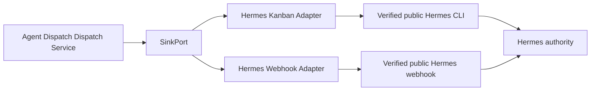

# Hermes Integration

## 1. Authority Statement

Hermes is the authoritative agent runtime. Agent Dispatch is one of its external activation tools.

v0.1 integration must satisfy all of the following:

- no Hermes source-code modification;
- no Hermes internal database access;
- no private Hermes API assumption;
- no Hermes plugin dependency;
- public CLI or public webhook only;
- optional Agent Dispatch-owned companion skill and receipt CLI.

## 2. Integration Layers



The logical port is stable. Physical commands and response parsing are adapter details established by verified public-interface evidence: the frozen E0-T4 report for the baseline, and — since the v0.1.5 destinations cutover (E11-T1, ADR-0017) — minimum-version eligibility with the capability probe that supersedes it (E11-T2 records per-executable shape evidence and binds activation to its fingerprint).

### E11-T2 Probe Contract

The shipped probe (`agent-dispatch hermes probe`, contract
`agent-dispatch.hermes-probe/v2`) proves five read-only shapes per
target: the `--version` first line and eligibility floor, the
`assignees --json` entry shape, the `list --json` entry shape, the
create-surface flag contract parsed from `create -h` (a missing
`--mutex-key` downgrades the resource_mutex capability; any other
missing flag refuses), and the profile-scoped skill table under the
fixed rendering environment (NO_COLOR, TERM=dumb, COLUMNS pinned). The
generated cache is keyed by executable path and digest, version, and
contract; any change invalidates it and blocks submission before side
effects (HER-013, AC-703). The E0-T4 frozen report below remains the
baseline evidence for the unconditional delivery set.

## 3. E0-T4 Capability Baseline

Before implementation, inspect the actual Hermes installation and record:

| Capability | Required evidence |
|---|---|
| Version discovery | Public command and machine-readable version |
| Task creation | Exact public command or endpoint, input fields, output schema |
| Durable acceptance | What response proves persistence across Hermes restart |
| Idempotency | Accepted key field/header and duplicate behavior |
| Lookup by key | Exact query and response |
| Lookup by task ID | Exact query and response |
| Mutex/serialization | Public field or absence |
| Profile and skill selection | Public supported fields |
| Workspace binding | Public supported field and normalization |
| Runtime/retry hints | Public supported fields; identify hints vs guarantees |
| Execution status | Portable mapping or unsupported |
| Authentication | Secret/reference mechanism |
| Error model | Exit codes, HTTP statuses, structured error schema |

The SOT intentionally does not invent these details.

## 4. Sink Capabilities

The adapter advertises boolean capabilities and numeric limits separately, matching `hermes-capability-report.schema.json` and `sink-adapter-contract.md`:

```text
SinkCapabilities {
  durable_acceptance: bool
  submit_idempotency_key: bool
  lookup_by_idempotency_key: bool
  lookup_by_external_ref: bool
  resource_mutex: bool
  execution_status: bool
  cancellation: bool
  result_receipt: bool
}

SinkLimits {
  maximum_request_bytes: integer
}
```

Since the v0.1.5 destinations cutover (E11-T1), hermes compatibility is gated by the `minimum_version` eligibility floor with the capability probe pending (E11-T2 restores per-executable shape evidence and binds activation to its fingerprint); the frozen 0.19.1 interface is the interim truth source for the unconditional delivery-evidence set. The `required_capabilities` comparison applies to webhook targets only: a required capability the static webhook declaration does not provide is a configuration error.

## 5. Logical Kanban Request

The core supplies a target-neutral request to the adapter. Its shape, field names, and schema are defined once in [`docs/contracts/hermes-task-contract.md`](../contracts/hermes-task-contract.md) §2 (`schemas/hermes-task-request.schema.json`); this document does not restate them.

The adapter maps this request to the real public Hermes interface. It does not add semantic instructions.

## 6. Task Instruction Boundary

The task has two clearly separated sections.

### Trusted operator instruction

- process the latest state of the configured vault;
- apply the configured LLM Wiki skill;
- re-evaluate indexing, referencing, and grouping;
- respect Hermes permissions and approvals;
- do not assume manifest paths still exist;
- submit a work receipt if the companion CLI is available.

### Untrusted event data

- dispatch ID;
- resource ID;
- normalized paths;
- create/modify/delete operations;
- hashes and source positions;
- structural flags.

No note body, front matter value, commit message, or source-provided prompt is inserted into the trusted instruction.

## 7. Kanban Submission Semantics

1. Create and commit a dispatch intent.
2. Acquire a local attempt lease.
3. invoke the public Hermes CLI with an argv array and controlled environment.
4. Bound stdout, stderr, and execution time.
5. Parse only verified structured output.
6. Map result to accepted, rejected, definite pre-submit transport failure, or unknown.
7. Persist attempt and receipt transactionally.

Human-readable text may be retained as a redacted diagnostic but must not be parsed for correctness.

## 8. Unknown Acceptance

Examples that become `unknown`:

- CLI timeout after process start;
- process killed after write to Hermes input;
- output truncation;
- malformed JSON after possible acceptance;
- connection reset after request transmission;
- Hermes reports an internal timeout without proving rollback.

Reconciliation order:

1. lookup by idempotency key — unsupported against the public CLI (the report records the port-level capability false, E8-T3), so this step never runs for hermes-kanban in v0.1;
2. lookup by known external reference;
3. inspect a public task listing only if the query is deterministic and bounded (not performed by the shipped adapter: unknown intents resolve through the reference lookup and the operator's retry/rerun exits);
4. if proven absent, schedule retry;
5. otherwise dead-letter or require operator resolution.

Never invoke the webhook as fallback.

## 9. Work Receipt Cooperation Without a Plugin

Agent Dispatch ships:

- `agent-dispatch work begin`;
- `agent-dispatch work complete`;
- `agent-dispatch work fail`;
- a Hermes companion skill describing how to use them.

The Hermes task contains the dispatch ID and resource ID. The skill may call the CLI before and after edits. This creates provenance without modifying Hermes.

Failure to submit a receipt is tolerated conservatively. Agent Dispatch may generate an additional follow-up task, but it does not suppress unknown changes.

## 10. Webhook Adapter

The webhook adapter is implemented in E6 after Kanban is production-capable. It is for explicit immediate or stateless delivery.

- It has its own target ID and capabilities.
- It resolves authentication outside SQLite.
- It sends the same logical task contract in structured form.
- It maps HTTP response to transport and, only if documented, durable acceptance.
- It is never selected automatically because Kanban submission is unknown.

The v0.1 capability declaration is static and offline, derived from the frozen E0-T4 §9 evidence (the receiving platform is inbound-only and not enabled in the probed installation, so no response contract proves durable acceptance):

| Capability | Declared | Reason |
|---|---|---|
| durable_acceptance | false | no verified response contract proves persistence |
| submit_idempotency_key | true | the core's key is transmitted verbatim under the configured header |
| lookup_by_idempotency_key / lookup_by_external_ref | false | no public lookup contract exists |
| resource_mutex / execution_status / cancellation / result_receipt | false | not provided by the interface |
| maximum_request_bytes | 262144 | Agent Dispatch's own bound (SEC-009) |

The conservative response mapping (WHK-004, DUR-005): 2xx is acceptance of the transmission with `durable=false` — never durable task acceptance; the definite request-refusal statuses (400, 401, 403, 404, 405, 406, 410, 413, 414, 415, 422) and unfollowed redirects (3xx) are definite rejections; 408, 409, 429, and every 5xx are unknown because their processing semantics are undocumented. Transport failures provably before transmission — name resolution, dialing, and the TLS handshake — are definite non-submission; everything after possible transmission is unknown. Unknown webhook dispatches dead-letter for the operator: the adapter declares no lookup, so drain reconciliation cannot resolve them and never submits through another sink.

## 11. Future Hermes Plugin

A future optional plugin may expose Agent Dispatch status, route pause/resume, quarantine, receipts, and manual operations inside Hermes. It remains a management surface. Sensing, SQLite state, policy, and dispatch correctness must continue to work when the plugin is absent or Hermes is stopped.

## 12. v0.1.5 Capability and Destination Target

ADR-0017 replaces the exact-version production gate with minimum-version
eligibility followed by capability probing. Versions below 0.19.1 fail before
probing; later versions have no fixed maximum. A route is compatible only when
the public command and response shapes needed by every configured destination
are usable under the process bounds in §3.

Profile enumeration uses `kanban assignees --json` and requires `on_disk=true`.
Enabled skills use the current public profile-scoped `skills list` command with
color disabled and a fixed wide rendering. Because Hermes does not expose JSON
for that command today, Agent Dispatch accepts only the complete known table
shape and rejects truncation or drift. This is an adapter constraint, not a
Hermes change or permission to inspect private profile storage.

Evidence is cached by executable absolute path and digest, reported version,
and probe-contract version. Production activation records the evidence
fingerprint beside the route revision. A mismatch pauses submission and emits
integration drift; it is never treated as proof of incompatibility or silently
accepted.
