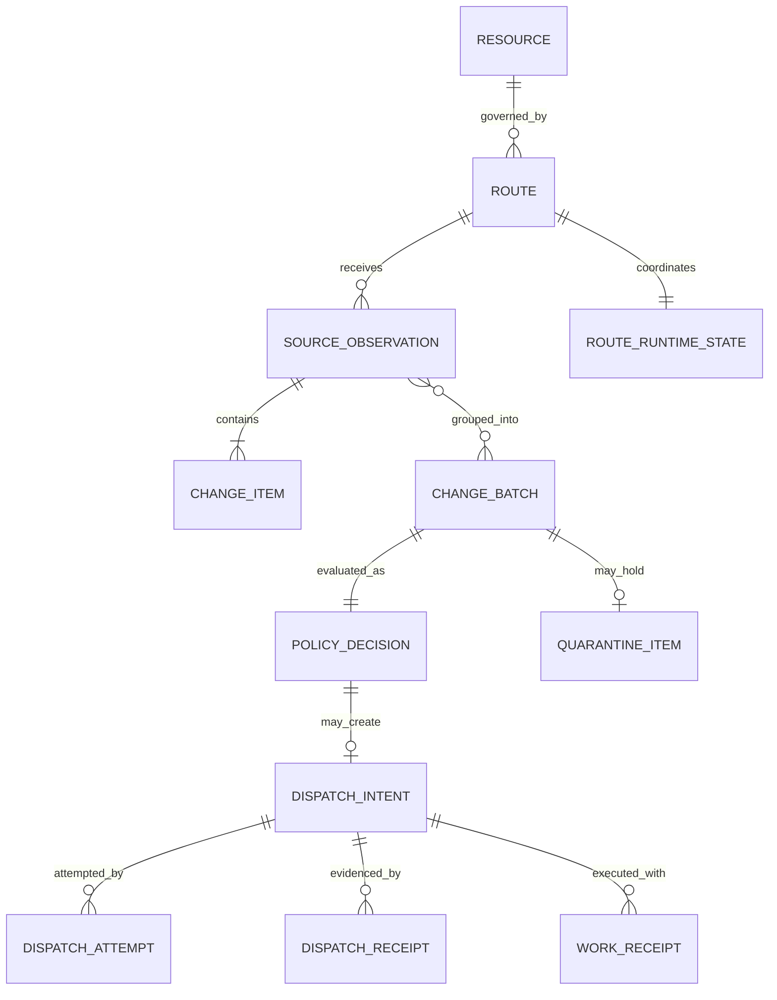

# Domain Model

## 1. Aggregate Overview



## 2. Resource

A `Resource` is trusted configuration, not event data.

```text
Resource {
  id                 stable operator name
  root               absolute path, resolved only inside Agent Dispatch
  canonical_root     symlink-resolved trusted root identity
  file_scope         markdown-only in v0.1
  git_mode           optional | disabled
}
```

The resource ID is safe to persist and include in task payloads. The absolute root is resolved at dispatch and may be redacted in ordinary logs.

## 3. Route

```text
Route {
  id
  revision
  source_id
  resource_id
  include_patterns
  exclude_patterns
  protected_patterns
  batch_limits
  structural_policy
  target_id
  hermes_profile
  hermes_skills
  mutex_key
  submission_retry_policy
  execution_hints
  failure_budget
  retention_policy
}
```

A route revision is a canonical SHA-256 digest of behavior-affecting normalized configuration. A policy revision is a digest of the policy subset. Secret values are excluded; secret reference identifiers may be included.

## 4. SourceObservation

A source observation is immutable evidence of one source delivery.

```text
SourceObservation {
  observation_id       UUIDv7
  schema_version
  source_id
  source_type           watchman
  source_event_key      optional stable retransmission key
  source_position       source-specific structured object
  resource_id
  trigger_name
  observed_at
  received_at
  raw_payload_digest
  source_flags          overflow, fresh_instance, relative_root
  ingest_status
}
```

The raw Watchman payload does not need to be stored. A bounded redacted copy may be retained only for diagnostics if explicitly enabled.

## 5. ChangeItem

```text
ChangeItem {
  observation_id
  ordinal
  relative_path
  operation             create | modify | delete
  exists_after
  file_type
  before_digest         optional
  after_digest          optional
  digest_status         known | unavailable | not_applicable
  source_fields         bounded non-authoritative metadata
}
```

Canonical ordering is by normalized UTF-8 relative path, then operation precedence `delete`, `create`, `modify`, then original ordinal as a final stable tiebreaker.

## 6. ChangeBatch

A batch is the policy evaluation unit.

```text
ChangeBatch {
  batch_id
  route_id
  route_revision
  resource_id
  created_at
  observation_ids[]
  changes[]
  content_fingerprint
  source_window
  batch_flags
}
```

A batch may include multiple observations only when a deterministic application operation intentionally merges them. A one-shot Watchman trigger normally creates one observation and one batch.

## 7. PolicyDecision

```text
PolicyDecision {
  decision_id
  batch_id                optional; observation-derived decisions only
  generation_lineage      optional { route_id, generation }; follow-up and reconciliation decisions only
  route_id
  route_revision
  policy_revision
  disposition           drop | dispatch | merge_pending | quarantine | reconcile
  classification[]      normal | protected | bulk | overflow | malformed | stale | unknown
  reason_codes[]
  created_at
  actor                  system | operator:<id>
  supersedes_decision_id optional
}
```

Exactly one of `batch_id` or `generation_lineage` is present. Observation-derived decisions reference the immutable batch that caused them. Follow-up and reconciliation decisions cover changes accumulated across multiple batches (or no batch at all, for scheduled reconciliation), so they reference the durable generation lineage instead.

Reasons are stable codes plus bounded parameters, not free-form hidden reasoning.

## 8. DispatchIntent

```text
DispatchIntent {
  dispatch_id
  decision_id
  route_id
  route_revision
  target_id
  target_type
  idempotency_key
  resource_id
  generation
  manifest_digest
  request_version
  state
  attempt_count
  next_attempt_at
  accepted_external_ref optional
  created_at
  updated_at
}
```

The dispatch request body is immutable after creation. A changed request requires a new dispatch intent.

## 9. DispatchAttempt

```text
DispatchAttempt {
  attempt_id
  dispatch_id
  lease_owner
  started_at
  completed_at
  outcome                accepted | rejected | unknown | transport_failure
  error_code
  response_digest
  redacted_diagnostic
}
```

An attempt is never reused.

## 10. DispatchReceipt

```text
DispatchReceipt {
  receipt_id
  dispatch_id
  receipt_kind           acceptance | execution_projection
  acceptance_state       accepted | rejected | unknown | null
  execution_state        unavailable | queued | running | succeeded | failed | canceled | null
  external_ref
  target_observed_at
  received_at
  payload_version
  bounded_payload
}
```

Acceptance and execution are independent axes.

## 11. RouteRuntimeState

```text
RouteRuntimeState {
  route_id
  activation_state       disabled | enabled | paused
  acknowledged_revision   nullable
  route_state            IDLE | ACTIVE_CLEAN | ACTIVE_DIRTY | FOLLOWUP_READY | UNCERTAIN | QUARANTINED
  active_dispatch_id     nullable
  active_generation      integer
  dirty_generation       integer
  dirty_since            nullable
  pending_reconcile      boolean
  last_source_position   structured
  last_reconciled_at
  version                optimistic concurrency counter
}
```

Invariant:

```text
active_dispatch_id != null
  => no second normal dispatch may become active for the same route
```

`active_dispatch_id` is reserved when the dispatch intent is created (intent creation and the reservation commit in one transaction) and cleared when that dispatch resolves. `route_state` is the persisted form of the route runtime state machine (see persistence-and-state-machines §6).

`dirty_generation > 0` means at least one later relevant change requires a follow-up after the active task is resolved. The counter is cleared exactly when that work is resolved — by the creation of a follow-up intent, or by a verified exact suppression clearing the route to IDLE — and it never compares against `active_generation` (E8-T1 records the invariant in this direction).

## 12. WorkReceipt

A work receipt is produced through Agent Dispatch's public receipt CLI or later MCP interface.

```text
WorkReceipt {
  receipt_id
  dispatch_id
  external_task_id
  run_id
  resource_id
  status                 begun | completed | failed
  base_revision          optional Git or opaque revision
  result_revision        optional
  changes[]              relative path, before/after digest
  submitted_at
  validation_state       valid | invalid | incomplete
  validation_reasons[]
}
```

A work receipt is not accepted merely because a Hermes agent supplied it. Agent Dispatch verifies route lineage, active dispatch, resource containment, path set, and digest evidence.

## 13. QuarantineItem

```text
QuarantineItem {
  quarantine_id
  batch_id
  decision_id
  reason_codes[]
  state                  held | released | discarded | superseded
  created_at
  resolved_at
  resolved_by
  resolution_reason
  replacement_decision_id
}
```

Release does not mutate the original decision. It creates a new operator decision and, if permitted, a new dispatch intent.

## 14. Identity Derivation

### Unique IDs

Use UUIDv7 or an equivalent time-ordered 128-bit identifier. Tests inject a deterministic ID generator.

### Content fingerprint

```text
content_fingerprint = SHA-256(
  canonical_json({
    resource_id,
    changes: sorted [
      {path, operation, before_digest, after_digest, exists_after}
    ],
    source_flags_affecting_semantics
  })
)
```

Timestamps, observation IDs, and source delivery attempt fields are excluded.

### Idempotency key

```text
idempotency_key = "agent-dispatch:v1:sha256:" + SHA-256(
  canonical_json({
    route_id,
    route_revision,
    target_id,
    generation,
    content_fingerprint,
    request_contract_version
  })
)
```

A manual `rerun` intentionally increments or replaces generation lineage so it receives a new key. A submission `retry` retains the key.

## 15. Invariants

1. Every decision references either an existing immutable batch or a durable generation lineage (route_id, generation).
2. Every dispatch references a `dispatch` or explicit operator-release decision.
3. An accepted dispatch cannot return to `ready`.
4. A new attempt cannot start while an unexpired attempt lease exists.
5. One route has at most one unresolved active dispatch.
6. Unknown acceptance cannot be converted to retryable failure without reconciliation evidence.
7. Suppression cannot occur without a valid exact work-receipt match.
8. Original records are never rewritten to represent a later policy decision.
