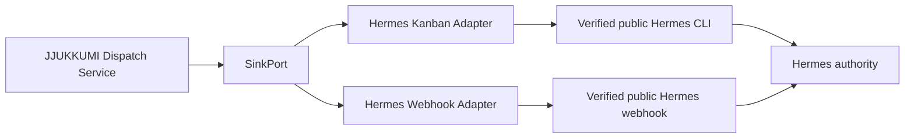

# Hermes Integration

## 1. Authority Statement

Hermes is the authoritative agent runtime. JJUKKUMI is one of its external activation tools.

v0.1 integration must satisfy all of the following:

- no Hermes source-code modification;
- no Hermes internal database access;
- no private Hermes API assumption;
- no Hermes plugin dependency;
- public CLI or public webhook only;
- optional JJUKKUMI-owned companion skill and receipt CLI.

## 2. Integration Layers



The logical port is stable. Physical commands and response parsing are adapter details established by a checked-in capability report.

## 3. E0-T4 Capability Baseline

Before implementation, inspect the actual Hermes installation and record:

| Capability | Required evidence |
|---|---|
| Version discovery | Public command and machine-readable version |
| Task creation | Exact public command or endpoint, input fields, output schema |
| Durable acceptance | What response proves persistence across Hermes restart |
| Idempotency | Accepted key field/header and duplicate behavior |
| Lookup by key | Exact query and response |
| Lookup by task ID | Exact query and response |
| Mutex/serialization | Public field or absence |
| Profile and skill selection | Public supported fields |
| Workspace binding | Public supported field and normalization |
| Runtime/retry hints | Public supported fields; identify hints vs guarantees |
| Execution status | Portable mapping or unsupported |
| Authentication | Secret/reference mechanism |
| Error model | Exit codes, HTTP statuses, structured error schema |

The SOT intentionally does not invent these details.

## 4. Sink Capabilities

The adapter advertises boolean capabilities and numeric limits separately, matching `hermes-capability-report.schema.json` and `sink-adapter-contract.md`:

```text
SinkCapabilities {
  durable_acceptance: bool
  submit_idempotency_key: bool
  lookup_by_idempotency_key: bool
  lookup_by_external_ref: bool
  resource_mutex: bool
  execution_status: bool
  cancellation: bool
  result_receipt: bool
}

SinkLimits {
  maximum_request_bytes: integer
}
```

Route validation compares `required_capabilities` with actual capabilities. A missing capability is an error unless an accepted reduced-guarantee configuration names the missing behavior and its operational consequence.

## 5. Logical Kanban Request

The core supplies a target-neutral request to the adapter. Its shape, field names, and schema are defined once in [`docs/02-contracts/hermes-task-contract.md`](../02-contracts/hermes-task-contract.md) §2 (`schemas/hermes-task-request.schema.json`); this document does not restate them.

The adapter maps this request to the real public Hermes interface. It does not add semantic instructions.

## 6. Task Instruction Boundary

The task has two clearly separated sections.

### Trusted operator instruction

- process the latest state of the configured vault;
- apply the configured LLM Wiki skill;
- re-evaluate indexing, referencing, and grouping;
- respect Hermes permissions and approvals;
- do not assume manifest paths still exist;
- submit a work receipt if the companion CLI is available.

### Untrusted event data

- dispatch ID;
- resource ID;
- normalized paths;
- create/modify/delete operations;
- hashes and source positions;
- structural flags.

No note body, front matter value, commit message, or source-provided prompt is inserted into the trusted instruction.

## 7. Kanban Submission Semantics

1. Create and commit a dispatch intent.
2. Acquire a local attempt lease.
3. invoke the public Hermes CLI with an argv array and controlled environment.
4. Bound stdout, stderr, and execution time.
5. Parse only verified structured output.
6. Map result to accepted, rejected, definite pre-submit transport failure, or unknown.
7. Persist attempt and receipt transactionally.

Human-readable text may be retained as a redacted diagnostic but must not be parsed for correctness.

## 8. Unknown Acceptance

Examples that become `unknown`:

- CLI timeout after process start;
- process killed after write to Hermes input;
- output truncation;
- malformed JSON after possible acceptance;
- connection reset after request transmission;
- Hermes reports an internal timeout without proving rollback.

Reconciliation order:

1. lookup by idempotency key;
2. lookup by known external reference;
3. inspect a public task listing only if the query is deterministic and bounded;
4. if proven absent, schedule retry;
5. otherwise dead-letter or require operator resolution.

Never invoke the webhook as fallback.

## 9. Work Receipt Cooperation Without a Plugin

JJUKKUMI ships:

- `jjukkumi work begin`;
- `jjukkumi work complete`;
- `jjukkumi work fail`;
- a Hermes companion skill describing how to use them.

The Hermes task contains the dispatch ID and resource ID. The skill may call the CLI before and after edits. This creates provenance without modifying Hermes.

Failure to submit a receipt is tolerated conservatively. JJUKKUMI may generate an additional follow-up task, but it does not suppress unknown changes.

## 10. Webhook Adapter

The webhook adapter is implemented in E6 after Kanban is production-capable. It is for explicit immediate or stateless delivery.

- It has its own target ID and capabilities.
- It resolves authentication outside SQLite.
- It sends the same logical task contract in structured form.
- It maps HTTP response to transport and, only if documented, durable acceptance.
- It is never selected automatically because Kanban submission is unknown.

## 11. Future Hermes Plugin

A future optional plugin may expose JJUKKUMI status, route pause/resume, quarantine, receipts, and manual operations inside Hermes. It remains a management surface. Sensing, SQLite state, policy, and dispatch correctness must continue to work when the plugin is absent or Hermes is stopped.
