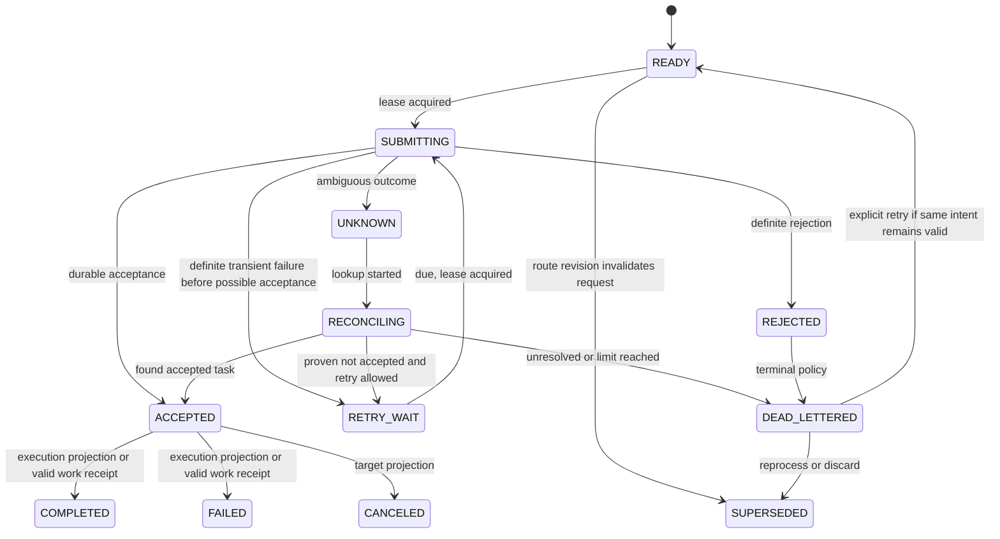
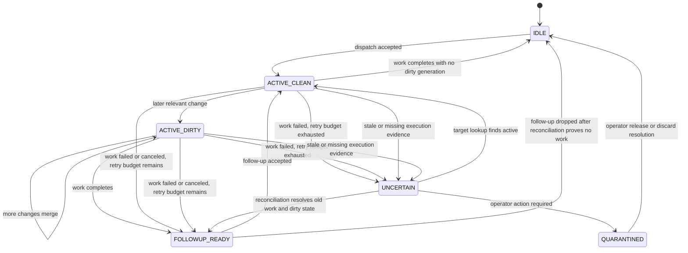

# Persistence and State Machines

## 1. SQLite Role

SQLite is a durable local spool, idempotency ledger, coordination mechanism, and audit store. It is mandatory before any Hermes or webhook side effect.

Recommended connection initialization:

```sql
PRAGMA foreign_keys = ON;
PRAGMA journal_mode = WAL;
PRAGMA synchronous = FULL;
PRAGMA busy_timeout = 5000;
```

The implementation must verify the resulting journal mode and fail `doctor` if the database is on an unsupported network filesystem or durability settings cannot be established. Exact pragmas may be changed only by an accepted ADR with crash-test evidence.

## 2. Conceptual Tables

| Table | Purpose | Key constraints |
|---|---|---|
| `schema_migrations` | Applied migration ledger | unique version |
| `resources` | Materialized trusted resource revisions | unique resource ID and revision |
| `routes` | Materialized route revisions | unique route ID and revision |
| `source_observations` | Immutable source delivery evidence | unique observation ID; optional unique source event key per source |
| `observation_changes` | Normalized path evidence | primary key observation ID + ordinal |
| `change_batches` | Canonical policy unit | unique batch ID |
| `batch_observations` | Many-to-many lineage | unique pair |
| `policy_decisions` | Immutable decisions | unique decision ID |
| `dispatch_intents` | Durable external intent | unique dispatch ID; unique target ID + idempotency key |
| `dispatch_attempts` | Submission attempts and leases | unique attempt ID |
| `dispatch_receipts` | Acceptance/execution evidence | unique receipt ID |
| `route_runtime_state` | One active task and dirty generation | primary key route ID |
| `path_facts` | Last known digest/existence by resource path | unique resource ID + path |
| `work_receipts` | Hermes companion provenance | unique receipt ID; indexed dispatch/run |
| `quarantine_items` | Operator-visible holds | unique quarantine ID |
| `state_transitions` | Append-only audit transitions | unique transition ID |

## 3. Dispatch State Machine



### State definitions

- `READY`: committed and eligible for submit.
- `SUBMITTING`: one process owns an unexpired attempt lease.
- `ACCEPTED`: durable target acceptance is proven.
- `REJECTED`: target definitely refused the request.
- `UNKNOWN`: target may or may not have accepted it.
- `RETRY_WAIT`: definite non-acceptance and persisted future eligibility.
- `RECONCILING`: lookup or operator investigation is in progress.
- `DEAD_LETTERED`: automatic progress stopped.
- `SUPERSEDED`: original request is no longer the request to submit.
- `COMPLETED`, `FAILED`, `CANCELED`: optional execution projection terminal states.

## 4. Acceptance vs Execution

A dispatch can be `ACCEPTED` while execution is `queued`, `running`, or unavailable. Do not overload the dispatch state with target-specific workflow stages. Store an execution projection receipt separately and use only the portable subset in core logic.

## 5. Attempt Lease

To submit an intent, a process must atomically:

```sql
UPDATE dispatch_intents
SET state = 'SUBMITTING', lease_owner = ?, lease_expires_at = ?, updated_at = ?
WHERE dispatch_id = ?
  AND state IN ('READY', 'RETRY_WAIT')
  AND next_attempt_at <= ?
  AND (lease_expires_at IS NULL OR lease_expires_at < ?);
```

The exact schema may differ, but ownership must be established by one conditional write checked by affected row count. Leases are recovery tools, not proof that a remote side effect did not happen.

If a process dies in `SUBMITTING`, recovery must inspect whether an attempt could have reached Hermes. Default to `UNKNOWN` unless the adapter can prove the process failed before external invocation.

## 6. Route Runtime State Machine



A cooperative failure or cancellation never erases dirty state: the activating changes remain unprocessed, and while the route's consecutive-failure budget remains (the route's configured `failure_budget`), one follow-up intent for latest state is created under the same collapse bound as completion. Budget exhaustion moves the route to `UNCERTAIN` and requires operator resolution. See `feedback-loop-and-reconciliation.md` §7.

## 7. Transaction Boundaries

### Observation transaction

Observation, changes, batch, decision, and route-generation update commit together.

### Intent transaction

For a dispatch decision, intent creation and route active-pending reservation commit together before submit.

### Attempt completion transaction

Attempt result, receipt, intent state, route active state, and audit transition commit together.

### Work completion transaction

Validated work receipt, active dispatch execution projection, exact suppression decision and, when a follow-up is required, the follow-up policy decision (referencing the dirty generation lineage) and follow-up intent creation commit together.

No SQLite transaction may remain open while calling Watchman, hashing a large file, invoking Hermes, or waiting on a network response.

## 8. Migrations

- Migrations are ordered SQL or Go migration units with immutable checksums.
- A migration runs under an exclusive application-level migration lock.
- The binary refuses to run against a newer unsupported schema.
- Down migrations are not required for production. Rollback uses a database backup and previous binary.
- Every migration has an upgrade test from every supported previous release schema.

## 9. Backups and Corruption

Before a schema migration, create a SQLite online backup or a safely checkpointed copy. `doctor` must run `PRAGMA quick_check` by default and allow an explicit full integrity check. A corrupt database must never be silently replaced. Recovery procedures are defined in the operations runbook.
