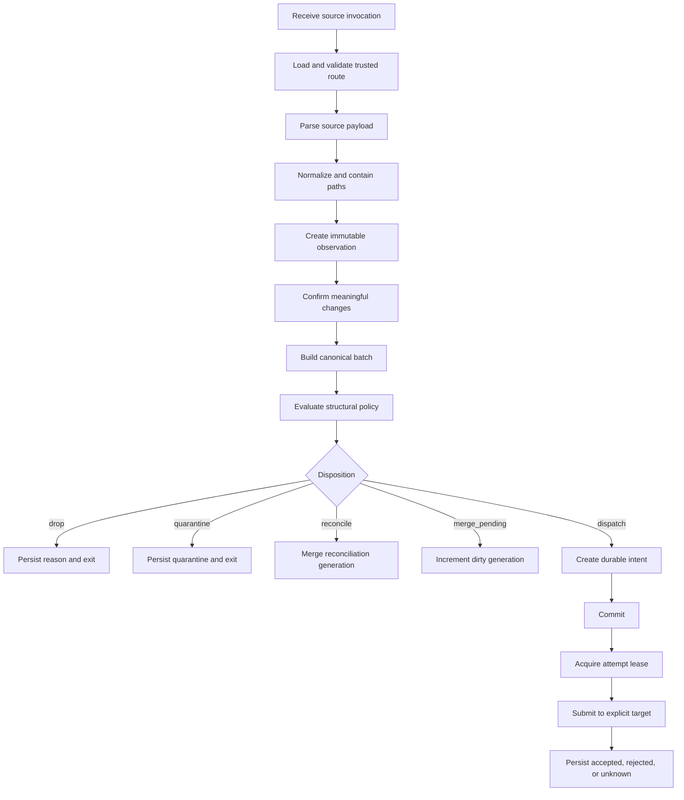

# Processing Pipeline

## 1. Pipeline Stages



## 2. Deterministic Planning Boundary

Stages through policy evaluation must be executable with `--dry-run` and no database or target side effect, except optional read-only database lookup for prior digests when explicitly requested. The dry-run output is a versioned `DispatchPlan`.

The planner takes:

```text
PlanInput {
  trusted route snapshot
  trusted resource snapshot
  normalized source input
  optional prior digest facts
  injected clock for output timestamp only
}
```

The planner returns:

```text
DispatchPlan {
  schema_version
  route_id and revision
  resource_id
  normalized changes
  content fingerprint
  structural classifications
  disposition
  reason codes
  required target capabilities
  proposed generation action
}
```

The planner must not call Hermes, mutate SQLite, modify files, or infer semantic note intent.

## 3. Ingestion Algorithm

```text
1. Resolve route by CLI argument.
2. Load configuration and verify route revision.
3. Verify trusted Watchman environment matches configured source and resource.
4. Parse bounded stdin JSON.
5. Reject unsupported schema or malformed entries.
6. Convert source file facts to canonical create/modify/delete candidates.
7. Normalize path separators and Unicode according to the path contract.
8. Enforce containment before filesystem access.
9. Apply include and exclude patterns.
10. For existing included Markdown files, calculate SHA-256 when required.
11. Compare with last known path digest.
12. Remove unchanged modifies and duplicate final path facts.
13. Detect protected, bulk, overflow, fresh-instance, and unknown conditions.
14. Sort canonical changes and derive fingerprint.
15. Decide disposition.
```

## 4. Same-Batch Coalescing

For multiple entries referring to the same relative path in one source batch, use the final observed filesystem state and source evidence:

| Source sequence | Canonical result |
|---|---|
| modify, modify | one modify with final digest |
| create, modify | one create with final digest (when the path has no prior digest; a create observed over a persisted prior path is conservatively a modify) |
| modify, delete | one delete |
| delete, create | create if file exists at planning time; mark `replacement=true` as optional evidence |
| create, delete | drop if the path did not exist before and does not exist after, otherwise delete with uncertainty reason |

Do not claim rename correctness. A delete and create may be included together and Hermes handles semantic reconciliation against latest state.

## 5. Disposition Rules

Evaluate in this precedence order:

1. **Malformed or unsafe path:** `quarantine` (durable hold; exit class 5, e.g. `unsafe_path_quarantined`) or reject the invocation before observation commit if no safe evidence can be stored (`source_malformed_json` or `source_unsafe_path`).
2. **Overflow, fresh instance, lost position:** `reconcile`.
3. **No meaningful changes:** `drop`.
4. **Protected or immutable path:** `quarantine`.
5. **Batch over hard limit:** `quarantine`.
6. **Batch over automatic threshold:** route-configured `quarantine` or `reconcile`.
7. **Unresolved active dispatch exists:** `merge_pending`.
8. **Normal bounded batch:** `dispatch`.

A source payload cannot request a different disposition.

## 6. Persisted Ingestion Transaction

One transaction should:

1. insert the source observation;
2. insert normalized change items;
3. insert the batch and observation relationship;
4. insert the policy decision;
5. update prior path digest facts where valid;
6. update route dirty or reconcile generation, or create a dispatch intent;
7. append state transition audit rows;
8. commit.

External submission happens after commit.

## 7. Dispatch Loop in a One-Shot Process

A `dispatch` invocation may attempt the newly created eligible intent and a bounded number of previously eligible intents for the same route. It must not become an unbounded worker.

Recommended v0.1 rule:

```text
max intents processed per invocation = 1 newly planned intent
                                  + 1 already due recovery intent
```

A dedicated `jjukkumi dispatches drain --max N` operator command may process more. Watchman must not invoke an unbounded drain.

Recovery of due `RETRY_WAIT` intents is intentionally trigger-driven in v0.1: a due retry is submitted by the next source event's dispatch invocation or by an explicit `dispatches drain`, never by a background timer. A route with no new events stays idle until the next event or operator action; pending retries remain visible in `status` and `dispatches list`.

## 8. Latest-State Task Semantics

The task manifest explains what caused activation, not what Hermes must reconstruct. Hermes is instructed to:

1. open the configured current vault;
2. verify the current note set;
3. perform LLM Wiki indexing, referencing, and grouping according to its skill;
4. avoid assuming that every manifest path still exists;
5. report completed work through the companion receipt interface when available.

## 9. Configuration Change Handling

Before an external submit, compare the intent's recorded route revision with the active route:

- If behavior-affecting configuration is unchanged, continue.
- If target, resource, profile, skills, path policy, or capability requirements changed, do not mutate the intent. Mark it `superseded` and create a new policy decision from the retained batch or generation lineage, which plans a replacement intent.
- If only retention or display settings changed, submission may continue.
- An already accepted task is not withdrawn or changed automatically.
