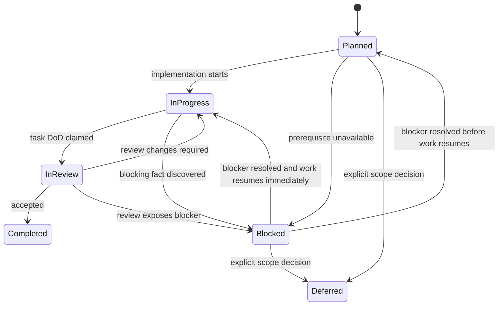

# Linear Task Execution Rules

## 1. Mandatory Status Values

Every epic and task uses exactly one of:

- **Planned**
- **In Progress**
- **In Review**
- **Completed**
- **Blocked**
- **Deferred**

Do not introduce synonyms such as todo, done, pending, active, or canceled in status fields.

## 2. Single-Task Rule

Only one task across the entire roadmap may be active at a time.

`In Progress` and `In Review` are both active states. Therefore:

```text
count(tasks where status in {In Progress, In Review}) <= 1
```

The next task cannot start while the current task is In Review. Review fixes remain part of the same task.

## 3. Mandatory Order

Tasks execute by numeric order:

```text
E0-T1 -> E0-T2 -> ... -> E6-T4
```

A later task may start only when every earlier non-deferred task is Completed. A Blocked task stops the roadmap. Skipping requires an explicit SOT or roadmap decision recorded in an ADR or decision log.

## 4. Allowed Transitions



`Completed` is immutable except when a formal audit reopens the task. Reopening requires a roadmap note and changes status back to In Progress; it also blocks later work until re-review.

## 5. Task Record Fields

Each task maintains:

```yaml
status: Planned
owner: null
started_at: null
review_started_at: null
completed_at: null
blocked_by: null
evidence:
  commits: []
  pull_requests: []
  test_reports: []
  documents: []
notes: []
```

The roadmap records `status` and the evidence trail inline (Objective,
Deliverables, Requirements, Dependencies, Acceptance, Evidence); the
owner/timestamp fields above are carried by the execution environment
(Podway session records and the Git commit metadata) rather than a
per-task YAML file (recorded deviation, E7-T10/M-31).

The roadmap Markdown table is the human SOT. A machine-readable tracker may be added later, but it must be generated from or reconciled with the roadmap.

## 6. Definition of Ready

A task is ready when:

- all preceding tasks are Completed or explicitly Deferred;
- inputs and SOT sections are available;
- acceptance criteria are objectively testable;
- no unresolved decision is hidden inside implementation;
- scope can be completed without starting a later task;
- required external tools are available or a fake is explicitly part of the task.

## 7. Definition of Done

A task may enter In Review only when:

- all listed deliverables exist;
- all task acceptance criteria pass;
- tests were added at the appropriate level;
- no test is skipped without an approved reason;
- documentation and schemas reflect behavior;
- requirement traceability is updated;
- `go test ./...` and the current repository verification command pass, when a Go module exists at that stage;
- no out-of-scope feature was partially introduced;
- evidence links are recorded.

A task becomes Completed only after review verifies these conditions.

## 8. Review Discipline

The reviewer checks:

1. correctness against required-spec IDs;
2. forbidden scope and authority violations;
3. state-transition and crash-window behavior;
4. security and redaction;
5. deterministic tests;
6. compatibility with earlier contracts;
7. whether later tasks were implemented prematurely.

Review comments are resolved within the same task. Do not start the next task to work around review feedback.

## 9. Blocked Handling

When blocked:

- change only the current task to Blocked;
- record the concrete missing fact or external dependency;
- record evidence already produced;
- state the smallest decision needed to unblock;
- do not begin a later task;
- do not weaken a MUST requirement silently.

## 10. Deferred Handling

Deferred means intentionally removed from the current release sequence. It requires:

- a reason;
- destination release or future-work section;
- impact on requirements and acceptance gates;
- explicit confirmation that no current MUST depends on it.
